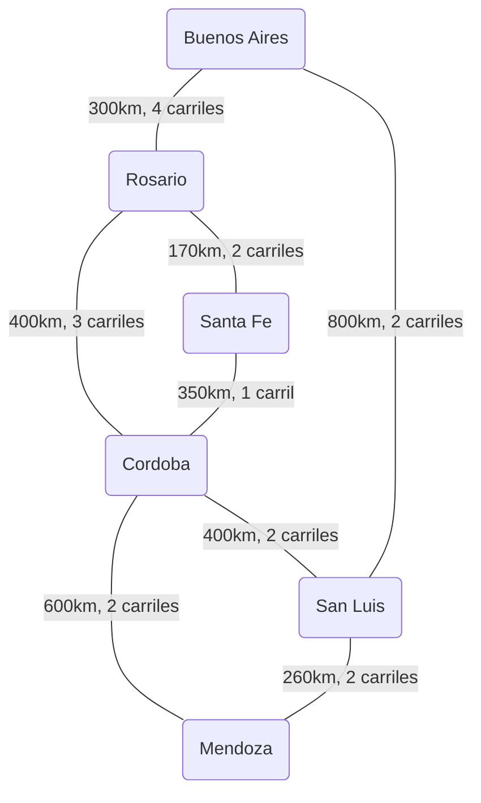

# Guía Completa de Estudio e Implementación: "Vamos de Paseo"

Esta guía consolida la teoría de grafos, el diseño orientado a objetos, el análisis algorítmico comparativo, las pautas de presentación para el video y la **explicación línea por línea de todo el código fuente**. Está guardada directamente en tu espacio de trabajo para que puedas copiarla, descargarla o visualizarla con facilidad.

---

## 1. Introducción al Problema y Concepto de Grafos

El proyecto **"Vamos de Paseo"** modela una red vial interurbana. En esta red:
1. **Vértices o Nodos (Localidades / Ciudades):** Representan los puntos de origen y destino en el mapa.
2. **Aristas o Arcos (Tramos de Carretera):** Conectan las ciudades y poseen dos pesos o criterios de optimización:
   - **Distancia (km):** Peso continuo que buscamos *minimizar* para hallar la ruta más corta.
   - **Carriles (capacidad):** Peso discreto que representa la capacidad de flujo. Buscamos *maximizar* la capacidad del tramo más angosto (cuello de botella) en el camino.

### El Criterio de Cuello de Botella (Flujo Máximo)
Cuando viajamos en auto, la velocidad y flujo total de la ruta no están determinados por los tramos más anchos, sino por el **más angosto** de todo el trayecto. Por ejemplo, en el camino:
$$\text{Ciudad A} \xrightarrow{4\text{ carriles}} \text{Ciudad B} \xrightarrow{2\text{ carriles}} \text{Ciudad C} \xrightarrow{5\text{ carriles}} \text{Ciudad D}$$
Aunque haya tramos de 4 y 5 carriles, el tramo intermedio de 2 carriles limitará el flujo a un máximo de **2 carriles**. El problema de optimización consiste en encontrar el camino entre origen y destino que logre que este valor mínimo (el cuello de botella) sea **el mayor posible** (conocido como *Widest Path Problem*).

---

## 2. Red de Prueba por Defecto (Red Vial Argentina)

El programa carga automáticamente un conjunto de ciudades y tramos para facilitar las pruebas del menú. A continuación se presenta el diagrama del grafo de prueba:



---

## 3. Estructura de Clases y Orientación a Objetos

El proyecto está diseñado bajo los principios de la Programación Orientada a Objetos (POO), separando las entidades de datos, la estructura del grafo y la interfaz de usuario.

- **`Ciudad.java` (Vértice):** Almacena y modela la localidad.
- **`Tramo.java` (Arista):** Modela la carretera y conecta el origen con el destino, portando la distancia en km y la cantidad de carriles.
- **`Grafo.java` (Estructura principal):** Aloja las listas de adyacencia y los algoritmos de búsqueda.
- **`Main.java` (UI y Entrada):** Maneja la interfaz del menú interactivo, la lectura segura de teclado y las pruebas.

---

## 4. Explicación de Código Línea por Línea

### 4.1. `Ciudad.java`
Representa un vértice del grafo.

```java
package parcial.vamos_de_paso;

import java.util.Objects;

/**
 * Clase que representa a una Ciudad (vértice del grafo).
 */
public class Ciudad {
    // Almacena el nombre único de la ciudad.
    private String nombre;

    // Constructor: Inicializa la ciudad asignándole un nombre.
    public Ciudad(String nombre) {
        this.nombre = nombre;
    }

    // Getter: Devuelve el nombre de la ciudad.
    public String getNombre() {
        return nombre;
    }

    // Setter: Permite modificar el nombre de la ciudad.
    public void setNombre(String nombre) {
        this.nombre = nombre;
    }

    // Sobrescritura de equals: Compara dos objetos Ciudad.
    // Es crítico para determinar si dos instancias representan la misma localidad.
    @Override
    public boolean equals(Object o) {
        // Si apuntan a la misma dirección de memoria, son iguales.
        if (this == o) return true;
        // Si el objeto a comparar es nulo o de una clase diferente, no son iguales.
        if (o == null || getClass() != o.getClass()) return false;
        // Casteo del objeto a tipo Ciudad.
        Ciudad ciudad = (Ciudad) o;
        // Son iguales si sus nombres (cadenas de texto) son idénticos.
        return Objects.equals(nombre, ciudad.nombre);
    }

    // Sobrescritura de hashCode: Genera un código hash único basado en el nombre.
    // Permite que la ciudad funcione correctamente en colecciones hash (como HashMap).
    @Override
    public int hashCode() {
        return Objects.hash(nombre);
    }

    // Sobrescritura de toString: Devuelve el nombre al imprimir el objeto directamente.
    @Override
    public String toString() {
        return nombre;
    }
}
```

---

### 4.2. `Tramo.java`
Representa una arista del grafo.

```java
package parcial.vamos_de_paso;

/**
 * Clase que representa un Tramo (arco o arista entre dos ciudades).
 * Contiene el origen, destino, la distancia en km y la cantidad de carriles.
 */
public class Tramo {
    private Ciudad origen;   // Ciudad de origen de la conexión.
    private Ciudad destino;  // Ciudad de destino de la conexión.
    private double distancia; // Peso de distancia en km (criterio 1).
    private int carriles;     // Capacidad en cantidad de carriles (criterio 2).

    // Constructor completo de 4 parámetros.
    public Tramo(Ciudad origen, Ciudad destino, double distancia, int carriles) {
        this.origen = origen;
        this.destino = destino;
        this.distancia = distancia;
        this.carriles = carriles;
    }

    // Retorna la ciudad de origen.
    public Ciudad getOrigen() {
        return origen;
    }

    // Modifica la ciudad de origen.
    public void setOrigen(Ciudad origen) {
        this.origen = origen;
    }

    // Retorna la ciudad de destino.
    public Ciudad getDestino() {
        return destino;
    }

    // Modifica la ciudad de destino.
    public void setDestino(Ciudad destino) {
        this.destino = destino;
    }

    // Retorna la distancia en kilómetros.
    public double getDistancia() {
        return distancia;
    }

    // Modifica la distancia del tramo.
    public void setDistancia(double distancia) {
        this.distancia = distancia;
    }

    // Retorna la cantidad de carriles (capacidad).
    public int getCarriles() {
        return carriles;
    }

    // Modifica la cantidad de carriles.
    public void setCarriles(int carriles) {
        this.carriles = carriles;
    }

    // Método toString: Representación visual legible de la conexión.
    @Override
    public String toString() {
        return origen.getNombre() + " -> " + destino.getNombre() + 
               " (Distancia: " + distancia + " km, Carriles: " + carriles + ")";
    }
}
```

---

### 4.3. `Grafo.java`
La estructura lógica y de búsqueda del grafo.

```java
package parcial.vamos_de_paso;

import java.util.*;

public class Grafo {
    // Mapa ciudades: Asocia el nombre en String con el objeto Ciudad para búsquedas directas.
    private Map<String, Ciudad> ciudades;
    
    // Lista de adyacencia: Asocia cada Ciudad con la lista de tramos (aristas) que se conectan a ella.
    private Map<Ciudad, List<Tramo>> adyacencias;

    // Constructor: Inicializa las colecciones vacías.
    public Grafo() {
        this.ciudades = new HashMap<>();
        this.adyacencias = new HashMap<>();
    }

    // Inserta una ciudad si no existe previamente.
    public void agregarCiudad(String nombre) {
        // Valida que el nombre no sea nulo ni consista solo en espacios.
        if (nombre == null || nombre.trim().isEmpty()) {
            System.out.println("El nombre de la ciudad no puede estar vacío.");
            return;
        }
        // Si no está registrado en el mapa de ciudades:
        if (!ciudades.containsKey(nombre)) {
            Ciudad nuevaCiudad = new Ciudad(nombre);
            // Agrega al mapa indexado por nombre.
            ciudades.put(nombre, nuevaCiudad);
            // Inicializa la lista de tramos vacía en el mapa de adyacencia.
            adyacencias.put(nuevaCiudad, new ArrayList<>());
        }
    }

    // Inserta una conexión bidireccional.
    public void agregarTramo(String origen, String destino, double distancia, int carriles) {
        // Validación de ciudades válidas y distintas.
        if (origen == null || destino == null || origen.equals(destino)) {
            System.out.println("Las ciudades origen y destino deben ser válidas y diferentes.");
            return;
        }

        // Intenta agregar ambas ciudades por si aún no existen en el grafo.
        agregarCiudad(origen);
        agregarCiudad(destino);

        // Obtiene las instancias de Ciudad correspondientes.
        Ciudad ciudadOrigen = ciudades.get(origen);
        Ciudad ciudadDestino = ciudades.get(destino);

        // Al ser un grafo NO dirigido, el tramo conecta en ambos sentidos:
        // Origen -> Destino y Destino -> Origen.
        adyacencias.get(ciudadOrigen).add(new Tramo(ciudadOrigen, ciudadDestino, distancia, carriles));
        adyacencias.get(ciudadDestino).add(new Tramo(ciudadDestino, ciudadOrigen, distancia, carriles));
    }

    // Recorre e imprime todas las adyacencias del grafo.
    public void mostrarGrafo() {
        System.out.println("=== ESTRUCTURA DEL GRAFO ===");
        // Itera sobre el set de entradas del mapa de adyacencia.
        for (Map.Entry<Ciudad, List<Tramo>> entry : adyacencias.entrySet()) {
            Ciudad ciudad = entry.getKey();
            List<Tramo> tramos = entry.getValue();
            System.out.print(ciudad.getNombre() + " conecta con:");
            if (tramos.isEmpty()) {
                System.out.println(" (Ninguna ciudad)");
            } else {
                System.out.println();
                // Imprime cada tramo individual.
                for (Tramo t : tramos) {
                    System.out.println("  " + t);
                }
            }
        }
        System.out.println("=============================");
    }

    // Getters para el mapa de ciudades y lista de adyacencia.
    public Map<String, Ciudad> getCiudades() {
        return ciudades;
    }

    public Map<Ciudad, List<Tramo>> getAdyacencias() {
        return adyacencias;
    }

    // ==========================================
    // MÉTODOS DEL INTEGRANTE 2 (Dijkstra Clásico)
    // ==========================================

    // Clase interna auxiliar para ordenar los vértices en la cola de prioridad de mínimo.
    private static class NodoDijkstra implements Comparable<NodoDijkstra> {
        Ciudad ciudad;
        double distanciaAcumulada;

        public NodoDijkstra(Ciudad ciudad, double distanciaAcumulada) {
            this.ciudad = ciudad;
            this.distanciaAcumulada = distanciaAcumulada;
        }

        // Compara las distancias para que la menor distancia sea extraída primero (Min-Priority Queue).
        @Override
        public int compareTo(NodoDijkstra otro) {
            return Double.compare(this.distanciaAcumulada, otro.distanciaAcumulada);
        }
    }

    // Encuentra la ruta más corta sumando distancias en kilómetros.
    public List<String> rutaMasCorta(String origen, String destino) {
        // Valida la existencia de ambos nodos.
        if (!ciudades.containsKey(origen) || !ciudades.containsKey(destino)) {
            System.out.println("Error: Una o ambas ciudades no existen en el grafo.");
            return null;
        }

        Ciudad ciudadOrigen = ciudades.get(origen);
        Ciudad ciudadDestino = ciudades.get(destino);

        // Mapa de distancias mínimas conocidas desde el origen.
        Map<Ciudad, Double> distancias = new HashMap<>();
        // Mapa para registrar el camino (relación hijo -> padre).
        Map<Ciudad, Ciudad> padres = new HashMap<>();
        // Cola de prioridad de mínimo.
        PriorityQueue<NodoDijkstra> colaPrioridad = new PriorityQueue<>();

        // Inicializa todas las distancias conocidas a infinito.
        for (Ciudad c : adyacencias.keySet()) {
            distancias.put(c, Double.MAX_VALUE);
        }

        // La distancia del origen a sí mismo es 0.0.
        distancias.put(ciudadOrigen, 0.0);
        colaPrioridad.add(new NodoDijkstra(ciudadOrigen, 0.0));

        while (!colaPrioridad.isEmpty()) {
            // Extrae el nodo con menor distancia acumulada.
            NodoDijkstra actual = colaPrioridad.poll();
            Ciudad u = actual.ciudad;

            // Si la distancia del registro es mayor que la mejor ya guardada, se ignora.
            if (actual.distanciaAcumulada > distancias.get(u)) {
                continue;
            }

            // Si se llega al destino, se puede finalizar la búsqueda.
            if (u.equals(ciudadDestino)) {
                break;
            }

            // Explora vecinos de u.
            List<Tramo> tramosVecinos = adyacencias.get(u);
            if (tramosVecinos != null) {
                for (Tramo tramo : tramosVecinos) {
                    Ciudad v = tramo.getDestino();
                    // Relajación de aristas: suma de distancia acumulada + peso del tramo.
                    double nuevaDistancia = distancias.get(u) + tramo.getDistancia();

                    // Si se encuentra una ruta más corta hacia v, se actualiza.
                    if (nuevaDistancia < distancias.get(v)) {
                        distancias.put(v, nuevaDistancia);
                        padres.put(v, u);
                        colaPrioridad.add(new NodoDijkstra(v, nuevaDistancia));
                    }
                }
            }
        }

        // Si el destino sigue en infinito, no hay conexión viable.
        if (distancias.get(ciudadDestino) == Double.MAX_VALUE) {
            System.out.println("No se encontró ninguna ruta entre " + origen + " y " + destino);
            return null;
        }

        // Reconstrucción reversa del camino usando el mapa de padres.
        List<String> camino = new ArrayList<>();
        Ciudad aux = ciudadDestino;
        while (aux != null) {
            camino.add(0, aux.getNombre()); // Inserta al inicio para revertir el orden.
            aux = padres.get(aux);
        }

        System.out.println("Ruta más corta desde " + origen + " hasta " + destino + ":");
        System.out.println("Camino: " + String.join(" -> ", camino));
        System.out.println("Distancia total: " + distancias.get(ciudadDestino) + " km");

        return camino;
    }

    // Calcula la ruta más corta desde un origen hacia todas las ciudades del grafo.
    public void rutaMasCortaDesdeOrigen(String origen) {
        if (!ciudades.containsKey(origen)) {
            System.out.println("Error: La ciudad origen \"" + origen + "\" no existe en el grafo.");
            return;
        }

        Ciudad ciudadOrigen = ciudades.get(origen);
        Map<Ciudad, Double> distancias = new HashMap<>();
        Map<Ciudad, Ciudad> padres = new HashMap<>();
        PriorityQueue<NodoDijkstra> colaPrioridad = new PriorityQueue<>();

        for (Ciudad c : adyacencias.keySet()) {
            distancias.put(c, Double.MAX_VALUE);
        }

        distancias.put(ciudadOrigen, 0.0);
        colaPrioridad.add(new NodoDijkstra(ciudadOrigen, 0.0));

        while (!colaPrioridad.isEmpty()) {
            NodoDijkstra actual = colaPrioridad.poll();
            Ciudad u = actual.ciudad;

            if (actual.distanciaAcumulada > distancias.get(u)) {
                continue;
            }

            List<Tramo> tramosVecinos = adyacencias.get(u);
            if (tramosVecinos != null) {
                for (Tramo tramo : tramosVecinos) {
                    Ciudad v = tramo.getDestino();
                    double nuevaDistancia = distancias.get(u) + tramo.getDistancia();

                    if (nuevaDistancia < distancias.get(v)) {
                        distancias.put(v, nuevaDistancia);
                        padres.put(v, u);
                        colaPrioridad.add(new NodoDijkstra(v, nuevaDistancia));
                    }
                }
            }
        }

        System.out.println("=== RUTAS MÁS CORTAS DESDE: " + origen + " ===");
        for (Ciudad destino : adyacencias.keySet()) {
            if (destino.equals(ciudadOrigen)) {
                continue;
            }

            double dist = distancias.get(destino);
            if (dist == Double.MAX_VALUE) {
                System.out.println("A " + destino.getNombre() + ": Inalcanzable");
            } else {
                List<String> camino = new ArrayList<>();
                Ciudad aux = destino;
                while (aux != null) {
                    camino.add(0, aux.getNombre());
                    aux = padres.get(aux);
                }
                System.out.println("A " + destino.getNombre() + ":");
                System.out.println("  Camino: " + String.join(" -> ", camino));
                System.out.println("  Distancia total: " + dist + " km");
            }
        }
        System.out.println("=========================================");
    }

    // ==========================================
    // MÉTODOS DEL INTEGRANTE 3 (Dijkstra Flujo Máximo / Widest Path)
    // ==========================================

    // Clase interna auxiliar para ordenar los vértices de mayor a menor capacidad de flujo (Max-Priority Queue).
    private static class NodoFlujo implements Comparable<NodoFlujo> {
        Ciudad ciudad;
        double capacidadCamino;

        public NodoFlujo(Ciudad ciudad, double capacidadCamino) {
            this.ciudad = ciudad;
            this.capacidadCamino = capacidadCamino;
        }

        // Compara para ordenar de mayor a menor (Max-Priority Queue).
        @Override
        public int compareTo(NodoFlujo otro) {
            return Double.compare(otro.capacidadCamino, this.capacidadCamino);
        }
    }

    // Encuentra la ruta que maximiza la capacidad del tramo más estrecho (evita cuellos de botella).
    public List<String> rutaMayorFlujo(String origen, String destino) {
        if (!ciudades.containsKey(origen) || !ciudades.containsKey(destino)) {
            System.out.println("Error: Una o ambas ciudades no existen en el grafo.");
            return null;
        }

        // Caso donde origen y destino coinciden.
        if (origen.equals(destino)) {
            System.out.println("Ruta con mayor flujo desde " + origen + " hasta " + destino + ":");
            System.out.println("Camino: " + origen);
            System.out.println("Capacidad máxima de flujo: Sin límite (origen y destino son iguales)");
            List<String> camino = new ArrayList<>();
            camino.add(origen);
            return camino;
        }

        Ciudad ciudadOrigen = ciudades.get(origen);
        Ciudad ciudadDestino = ciudades.get(destino);

        // Mapa para registrar la capacidad máxima del cuello de botella para cada nodo.
        Map<Ciudad, Double> capacidades = new HashMap<>();
        Map<Ciudad, Ciudad> padres = new HashMap<>();
        PriorityQueue<NodoFlujo> colaPrioridad = new PriorityQueue<>();

        // Inicializa todas las capacidades conocidas a 0.0 (mínimo flujo posible).
        for (Ciudad c : adyacencias.keySet()) {
            capacidades.put(c, 0.0);
        }

        // La capacidad para llegar al origen es infinita (MAX_VALUE).
        capacidades.put(ciudadOrigen, Double.MAX_VALUE);
        colaPrioridad.add(new NodoFlujo(ciudadOrigen, Double.MAX_VALUE));

        while (!colaPrioridad.isEmpty()) {
            // Extrae el nodo que tiene el camino con mayor capacidad de flujo.
            NodoFlujo actual = colaPrioridad.poll();
            Ciudad u = actual.ciudad;

            // Si la capacidad del registro es menor a la mejor ya registrada, se ignora.
            if (actual.capacidadCamino < capacidades.get(u)) {
                continue;
            }

            // Detiene la búsqueda si llega al destino.
            if (u.equals(ciudadDestino)) {
                break;
            }

            List<Tramo> tramosVecinos = adyacencias.get(u);
            if (tramosVecinos != null) {
                for (Tramo tramo : tramosVecinos) {
                    Ciudad v = tramo.getDestino();
                    
                    // La capacidad al vecino v a través de u es el mínimo entre la capacidad
                    // acumulada hasta u y la capacidad de la carretera (carriles del tramo).
                    double capacidadTentativa = Math.min(capacidades.get(u), tramo.getCarriles());

                    // Si esta capacidad tentativa es mayor que la mejor conocida para v:
                    if (capacidadTentativa > capacidades.get(v)) {
                        capacidades.put(v, capacidadTentativa); // Actualiza la capacidad de v.
                        padres.put(v, u);                       // Registra el padre.
                        colaPrioridad.add(new NodoFlujo(v, capacidadTentativa)); // Añade a la cola.
                    }
                }
            }
        }

        // Si la capacidad al destino es 0.0, no existe conexión alguna.
        if (capacidades.get(ciudadDestino) == 0.0) {
            System.out.println("No se encontró ninguna ruta entre " + origen + " y " + destino);
            return null;
        }

        // Reconstrucción del camino.
        List<String> camino = new ArrayList<>();
        Ciudad aux = ciudadDestino;
        while (aux != null) {
            camino.add(0, aux.getNombre());
            aux = padres.get(aux);
        }

        System.out.println("Ruta con mayor capacidad de flujo desde " + origen + " hasta " + destino + ":");
        System.out.println("Camino: " + String.join(" -> ", camino));
        System.out.println("Capacidad máxima de flujo (cuello de botella): " + (int) (double) capacidades.get(ciudadDestino) + " carriles");

        return camino;
    }

    // Calcula la capacidad de flujo máxima desde una ciudad origen hacia todas las demás.
    public void rutaMayorFlujoDesdeOrigen(String origen) {
        if (!ciudades.containsKey(origen)) {
            System.out.println("Error: La ciudad origen \"" + origen + "\" no existe en el grafo.");
            return;
        }

        Ciudad ciudadOrigen = ciudades.get(origen);
        Map<Ciudad, Double> capacidades = new HashMap<>();
        Map<Ciudad, Ciudad> padres = new HashMap<>();
        PriorityQueue<NodoFlujo> colaPrioridad = new PriorityQueue<>();

        for (Ciudad c : adyacencias.keySet()) {
            capacidades.put(c, 0.0);
        }

        capacidades.put(ciudadOrigen, Double.MAX_VALUE);
        colaPrioridad.add(new NodoFlujo(ciudadOrigen, Double.MAX_VALUE));

        while (!colaPrioridad.isEmpty()) {
            NodoFlujo actual = colaPrioridad.poll();
            Ciudad u = actual.ciudad;

            if (actual.capacidadCamino < capacidades.get(u)) {
                continue;
            }

            List<Tramo> tramosVecinos = adyacencias.get(u);
            if (tramosVecinos != null) {
                for (Tramo tramo : tramosVecinos) {
                    Ciudad v = tramo.getDestino();
                    double capacidadTentativa = Math.min(capacidades.get(u), tramo.getCarriles());

                    if (capacidadTentativa > capacidades.get(v)) {
                        capacidades.put(v, capacidadTentativa);
                        padres.put(v, u);
                        colaPrioridad.add(new NodoFlujo(v, capacidadTentativa));
                    }
                }
            }
        }

        System.out.println("=== RUTAS CON MAYOR CAPACIDAD DE FLUJO DESDE: " + origen + " ===");
        for (Ciudad destino : adyacencias.keySet()) {
            if (destino.equals(ciudadOrigen)) {
                continue;
            }

            double cap = capacidades.get(destino);
            if (cap == 0.0) {
                System.out.println("A " + destino.getNombre() + ": Inalcanzable");
            } else {
                List<String> camino = new ArrayList<>();
                Ciudad aux = destino;
                while (aux != null) {
                    camino.add(0, aux.getNombre());
                    aux = padres.get(aux);
                }
                System.out.println("A " + destino.getNombre() + ":");
                System.out.println("  Camino: " + String.join(" -> ", camino));
                System.out.println("  Capacidad máxima (cuello de botella): " + (int) cap + " carriles");
            }
        }
        System.out.println("=========================================================");
    }
}
```

---

### 4.4. `Main.java`
La interfaz de menú consola y lectura.

```java
package parcial.vamos_de_paso;

import java.util.Scanner;

public class Main {

    // Método principal: Punto de partida del software.
    public static void main(String[] args) {
        Grafo grafo = new Grafo();
        // Inicializa el lector de flujos de entrada del sistema (consola).
        Scanner scanner = new Scanner(System.in);

        // Invoca el cargador de la base de datos vial por defecto.
        cargarDatosDePrueba(grafo);

        boolean continuar = true;
        // Bucle del menú: permite iterar indefinidamente sin reiniciar el programa.
        while (continuar) {
            System.out.println("\n=============================================");
            System.out.println("          MENÚ PRINCIPAL - VAMOS DE PASEO    ");
            System.out.println("=============================================");
            System.out.println("1. Agregar ciudad");
            System.out.println("2. Agregar conexión (tramo)");
            System.out.println("3. Mostrar grafo");
            System.out.println("4. Consultar ruta más corta (Dijkstra)");
            System.out.println("5. Consultar ruta con mayor flujo (Widest Path)");
            System.out.println("6. Consultar rutas desde origen (distancia y flujo)");
            System.out.println("7. Salir");
            System.out.println("=============================================");
            System.out.print("Seleccione una opción: ");

            // Lee la línea escrita, limpia espacios en blanco al inicio/final.
            String opcionStr = scanner.nextLine().trim();
            switch (opcionStr) {
                case "1":
                    agregarCiudadMenu(grafo, scanner);
                    break;
                case "2":
                    agregarConexionMenu(grafo, scanner);
                    break;
                case "3":
                    grafo.mostrarGrafo();
                    break;
                case "4":
                    consultarRutaMasCortaMenu(grafo, scanner);
                    break;
                case "5":
                    consultarRutaMayorFlujoMenu(grafo, scanner);
                    break;
                case "6":
                    consultarDesdeCiudadHaciaTodas(grafo, scanner);
                    break;
                case "7":
                    System.out.println("\n¡Gracias por utilizar Vamos de Paseo! ¡Buen viaje!");
                    continuar = false; // Finaliza la condición de permanencia del bucle.
                    break;
                default:
                    System.out.println("Opción no válida. Por favor, intente de nuevo.");
            }
        }
        scanner.close(); // Cierra el flujo del Scanner para liberar recursos.
    }

    // Inicializa la red vial argentina precargando tramos de carretera.
    private static void cargarDatosDePrueba(Grafo grafo) {
        System.out.println("Cargando ciudades y tramos de prueba (Red Vial Argentina)...");
        grafo.agregarTramo("Buenos Aires", "Rosario", 300.0, 4);
        grafo.agregarTramo("Buenos Aires", "San Luis", 800.0, 2);
        grafo.agregarTramo("Rosario", "Cordoba", 400.0, 3);
        grafo.agregarTramo("Rosario", "Santa Fe", 170.0, 2);
        grafo.agregarTramo("Cordoba", "Mendoza", 600.0, 2);
        grafo.agregarTramo("San Luis", "Mendoza", 260.0, 2);
        grafo.agregarTramo("Santa Fe", "Cordoba", 350.0, 1);
        grafo.agregarTramo("Cordoba", "San Luis", 400.0, 2);
        System.out.println("Datos cargados con éxito.");
    }

    // Lee el nombre y lo inserta en el grafo (Validando duplicados).
    private static void agregarCiudadMenu(Grafo grafo, Scanner scanner) {
        System.out.println("\n--- AGREGAR CIUDAD ---");
        System.out.print("Ingrese el nombre de la ciudad: ");
        String nombre = scanner.nextLine().trim();
        if (nombre.isEmpty()) {
            System.out.println("El nombre de la ciudad no puede estar vacío.");
            return;
        }
        if (grafo.getCiudades().containsKey(nombre)) {
            System.out.println("La ciudad \"" + nombre + "\" ya existe en el grafo.");
        } else {
            grafo.agregarCiudad(nombre);
            System.out.println("Ciudad \"" + nombre + "\" agregada con éxito.");
        }
    }

    // Captura origen, destino, distancia y carriles robustamente.
    private static void agregarConexionMenu(Grafo grafo, Scanner scanner) {
        System.out.println("\n--- AGREGAR CONEXIÓN ---");
        System.out.print("Ingrese ciudad origen: ");
        String origen = scanner.nextLine().trim();
        System.out.print("Ingrese ciudad destino: ");
        String destino = scanner.nextLine().trim();

        if (origen.isEmpty() || destino.isEmpty()) {
            System.out.println("Las ciudades no pueden estar vacías.");
            return;
        }
        if (origen.equalsIgnoreCase(destino)) {
            System.out.println("La ciudad origen y destino deben ser distintas.");
            return;
        }

        // Lectura segura contra letras o caracteres inválidos.
        double distancia = leerDouble(scanner, "Ingrese la distancia en km: ");
        if (distancia <= 0) {
            System.out.println("La distancia debe ser un número positivo.");
            return;
        }

        // Lectura segura contra letras o enteros no válidos.
        int carriles = leerEntero(scanner, "Ingrese la cantidad de carriles: ");
        if (carriles <= 0) {
            System.out.println("La cantidad de carriles debe ser un número entero positivo.");
            return;
        }

        grafo.agregarTramo(origen, destino, distancia, carriles);
        System.out.println("Conexión entre \"" + origen + "\" y \"" + destino + "\" agregada con éxito.");
    }

    // Llama al algoritmo de distancia mínima.
    private static void consultarRutaMasCortaMenu(Grafo grafo, Scanner scanner) {
        System.out.println("\n--- CONSULTAR RUTA MÁS CORTA ---");
        System.out.print("Ingrese ciudad de origen: ");
        String origen = scanner.nextLine().trim();
        System.out.print("Ingrese ciudad de destino: ");
        String destino = scanner.nextLine().trim();

        if (origen.isEmpty() || destino.isEmpty()) {
            System.out.println("Las ciudades origen y destino no pueden estar vacías.");
            return;
        }

        grafo.rutaMasCorta(origen, destino);
    }

    // Llama al algoritmo de flujo máximo.
    private static void consultarRutaMayorFlujoMenu(Grafo grafo, Scanner scanner) {
        System.out.println("\n--- CONSULTAR RUTA CON MAYOR FLUJO ---");
        System.out.print("Ingrese ciudad de origen: ");
        String origen = scanner.nextLine().trim();
        System.out.print("Ingrese ciudad de destino: ");
        String destino = scanner.nextLine().trim();

        if (origen.isEmpty() || destino.isEmpty()) {
            System.out.println("Las ciudades origen y destino no pueden estar vacías.");
            return;
        }

        grafo.rutaMayorFlujo(origen, destino);
    }

    // Realiza la consulta múltiple desde origen hacia todos los destinos (distancia y flujo).
    private static void consultarDesdeCiudadHaciaTodas(Grafo grafo, Scanner scanner) {
        System.out.println("\n--- CONSULTAR RUTAS DESDE ORIGEN (HACIA TODOS LOS DESTINOS) ---");
        System.out.print("Ingrese la ciudad origen: ");
        String origen = scanner.nextLine().trim();

        if (origen.isEmpty()) {
            System.out.println("La ciudad de origen no puede estar vacía.");
            return;
        }

        // 1. Mostrar rutas más cortas (distancias mínimas)
        grafo.rutaMasCortaDesdeOrigen(origen);
        System.out.println();
        // 2. Mostrar rutas con mayor flujo (capacidades máximas)
        grafo.rutaMayorFlujoDesdeOrigen(origen);
    }

    // Lector robusto de decimales: Atrapa excepciones de formato y re-intenta.
    private static double leerDouble(Scanner scanner, String mensaje) {
        while (true) {
            System.out.print(mensaje);
            String entrada = scanner.nextLine().trim();
            try {
                return Double.parseDouble(entrada);
            } catch (NumberFormatException e) {
                System.out.println("Error: Por favor, ingrese un número decimal válido.");
            }
        }
    }

    // Lector robusto de enteros: Atrapa excepciones de formato y re-intenta.
    private static int leerEntero(Scanner scanner, String mensaje) {
        while (true) {
            System.out.print(mensaje);
            String entrada = scanner.nextLine().trim();
            try {
                return Integer.parseInt(entrada);
            } catch (NumberFormatException e) {
                System.out.println("Error: Por favor, ingrese un número entero válido.");
            }
        }
    }
}
```

---

## 5. Tabla Comparativa de los Algoritmos Implementados

A continuación se detallan las diferencias esenciales entre Dijkstra Clásico y Widest Path para las exposiciones orales:

| Criterio | Ruta Más Corta (Dijkstra Clásico) | Ruta con Mayor Flujo (Widest Path) |
| :--- | :--- | :--- |
| **Objetivo Matemático** | Minimizar la distancia acumulada. | Maximizar el flujo del tramo más angosto. |
| **Cola de Prioridad** | **Min-Priority Queue:** Extrae primero el nodo con menor distancia acumulada. | **Max-Priority Queue:** Extrae primero el nodo con mayor capacidad de flujo transitorio. |
| **Fórmula de Relajación** | $\text{distancia}[v] = \text{distancia}[u] + \text{peso}(u, v)$ | $\text{capacidad}[v] = \min(\text{capacidad}[u], \text{carriles}(u, v))$ |
| **Condición de Cambio** | $\text{nuevaDistancia} < \text{distancia}[v]$ | $\text{capacidadTentativa} > \text{capacidades}[v]$ |
| **Inicialización Origen** | $0.0$ | `Double.MAX_VALUE` (capacidad ilimitada) |
| **Inicialización Demás** | $\infty$ (`Double.MAX_VALUE`) | $0.0$ (capacidad mínima) |

---

## 6. Estructura de Exposición Sugerida para el Video

Para cumplir con la rúbrica del parcial y respetar el límite de **5 minutos**, se sugiere organizar la presentación de la siguiente manera:

- **Integrante 1 (Estructura y Menú):**
  - Explica cómo se modeló el problema con grafos no dirigidos.
  - Explica la lista de adyacencias representada por el mapa `adyacencias` de `Grafo.java`.
  - Corre el programa y enseña la navegación inicial y la opción `3` (Mostrar Grafo).
- **Integrante 2 (Ruta Más Corta):**
  - Explica la teoría clásica de Dijkstra (sumas acumuladas y cola de prioridad de mínimo).
  - Muestra el fragmento de código de `rutaMasCorta` en `Grafo.java`.
  - Demuestra en consola una consulta de ruta más corta (ej. Buenos Aires a Mendoza).
- **Integrante 3 (Flujo Máximo e Integración):**
  - Explica la teoría del cuello de botella y el cálculo de la arista limitante (`Math.min`).
  - Muestra el código de `rutaMayorFlujo` y la clase auxiliar `NodoFlujo` (Max-Priority Queue).
  - **Prueba del Cuello de Botella (Demostración de alto impacto):**
    1. Agrega un tramo directo entre **Buenos Aires** y **Mendoza** con distancia **900 km** y **1 carril**.
    2. Consulta la ruta más corta (mostrará la nueva ruta directa de 900 km).
    3. Consulta la ruta de mayor flujo (mostrará que sigue eligiendo la ruta de 2 carriles vía Rosario y Córdoba, evadiendo la de 1 carril), confirmando el éxito matemático del algoritmo.
    4. Muestra la consulta múltiple desde origen (Opción `6`).
